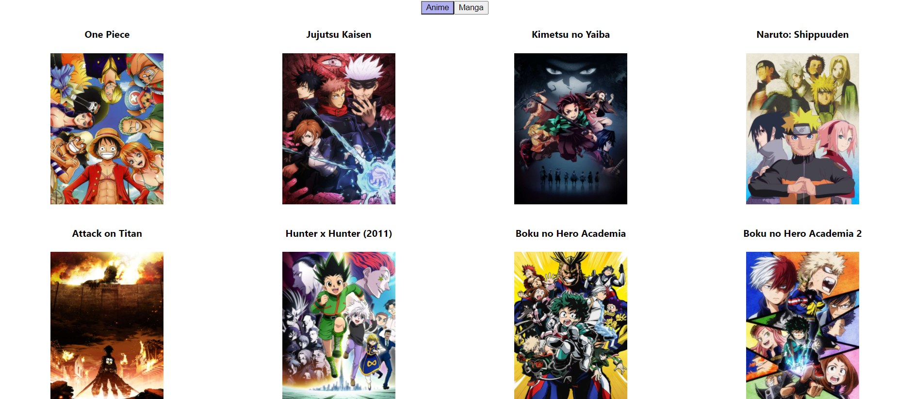
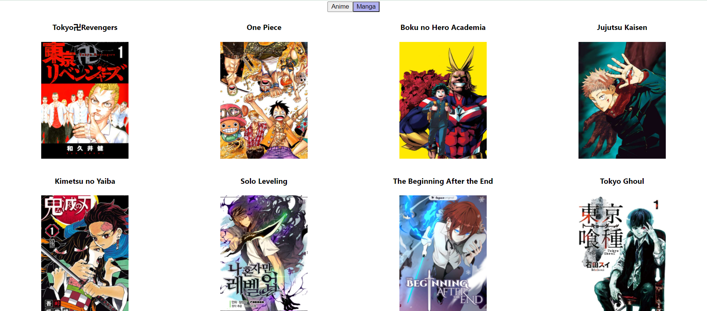

## W04D04HW- useState, useEffect, axios
Create web page that contain 2 buttons, when clicking on a button, get data from the corresponding kitsu API endpoint(https://kitsu.io/api/edge//trending/\<resourceType>) and display the name and image.
### Guide: 
* Create 2 state: 
    1. resourceType and by default use anime
    2. items by default is an empty array 
* Create 2 button each button will have onClick event that will change the resourceType state: anime, manga
* Use useEffect to get the data from https://kitsu.io/api/edge//trending/\<resourceType> using **axios**
    * items array will change based on what they get from response 
* display items using map

